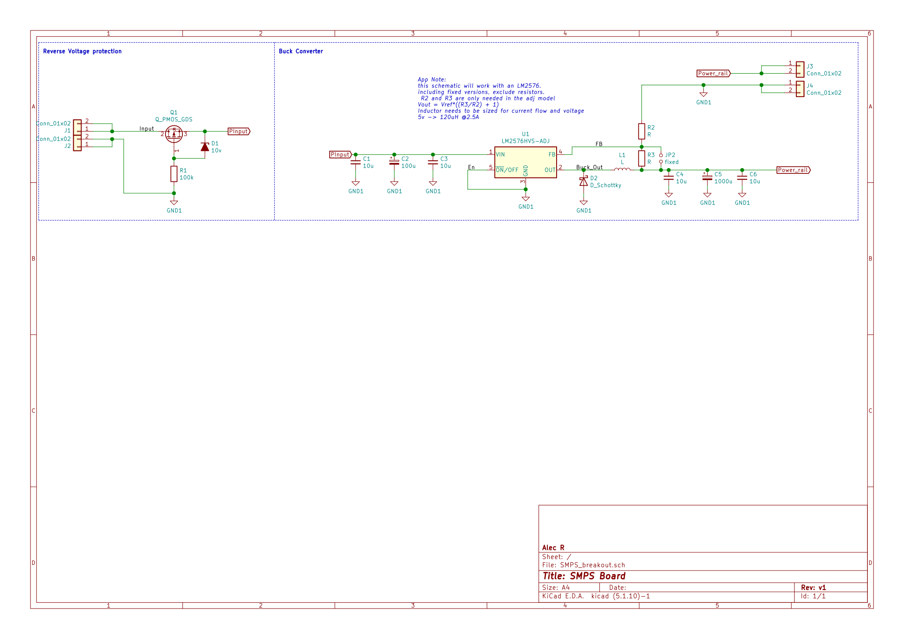
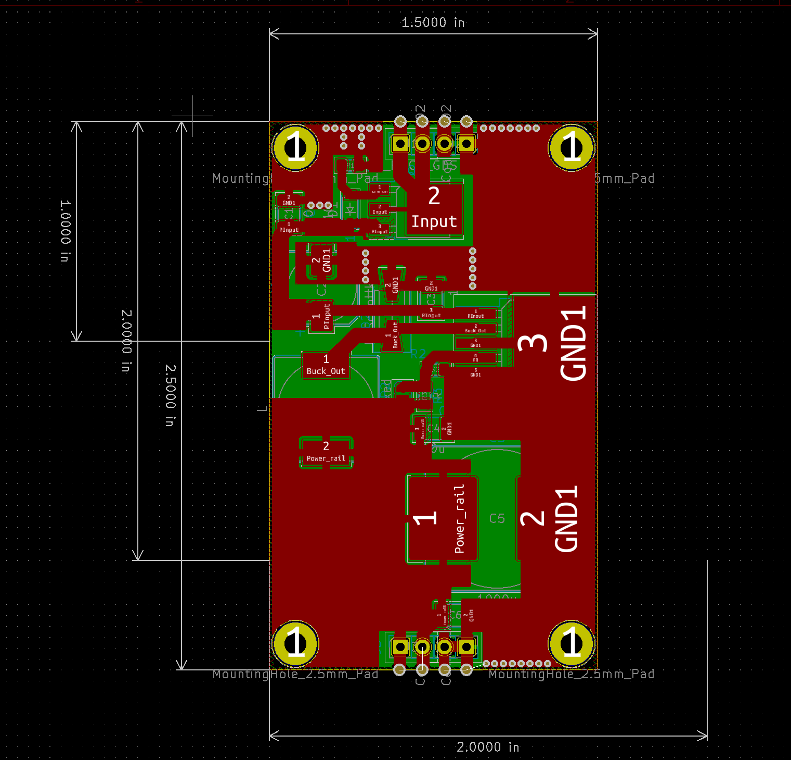
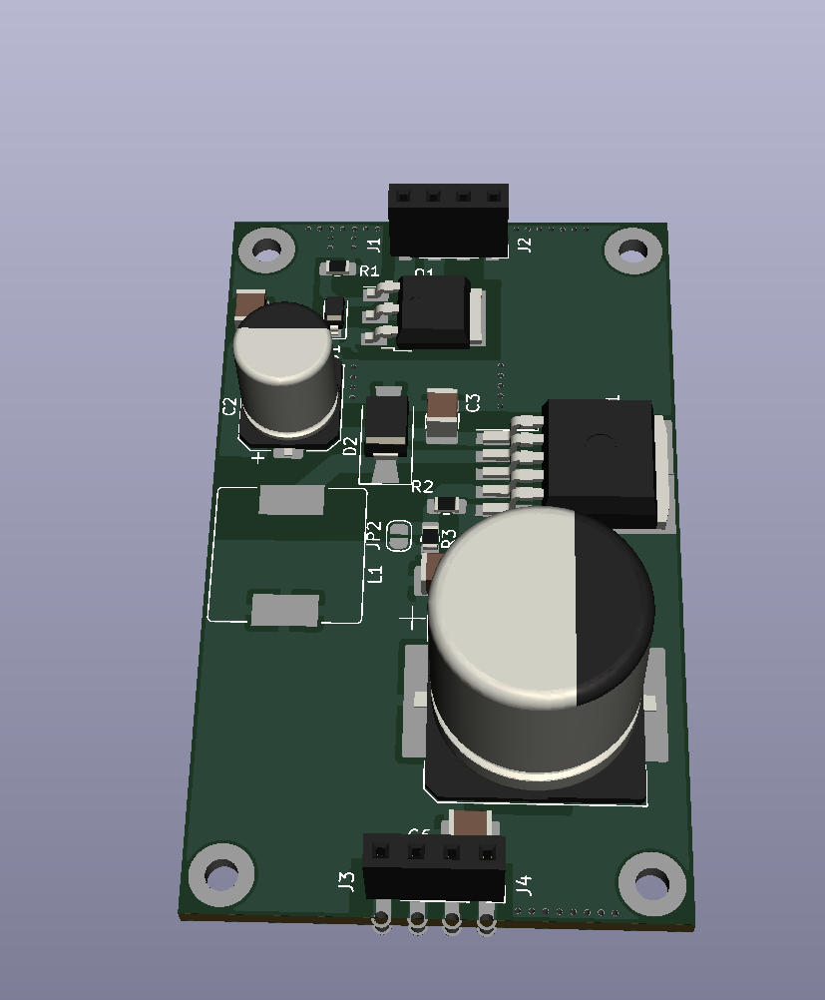

# SMPS-Board
This is a Switch Mode Power Supply Board based on the LM2576, with output capibilities of 3.3-36V, 3A. 

### Design
this is designed to be an independent board to be the main power supply for most projects, it does not take mains input, input is meant to be either plugpack, or independent AC-DC Unit such as a Meanwell 24v, 300W supply and then transform it into 3.3V, 5V, or 12V. 

this design uses the multifaceted nature of the LM2576, as it will work with the LM2576-ADJ, LM2576-HV, LM2576-F3.3, LM2576-F5, or LM2576-F12. This meant some concern had to be taken to allow it to work either with the Adjustable or fixed versions. Some of the design rules are taken from the APP notes of the TI version datasheet. it is also designed with input protection of a PMOSFET (rather than diode protection).
It is designed to take full use of all of the copper surface of the PCB, as all of the copper is paid for to produce anyway with large planes to carry current as well as heat.

mockup:

